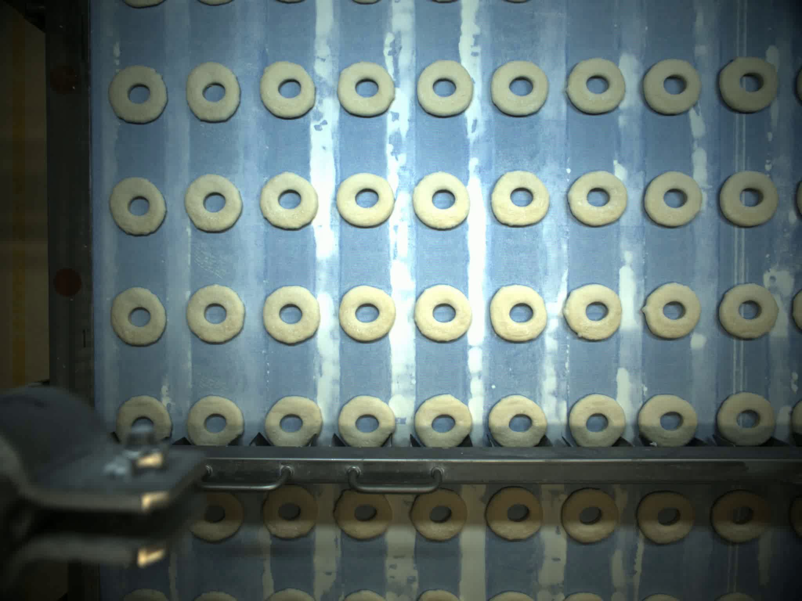
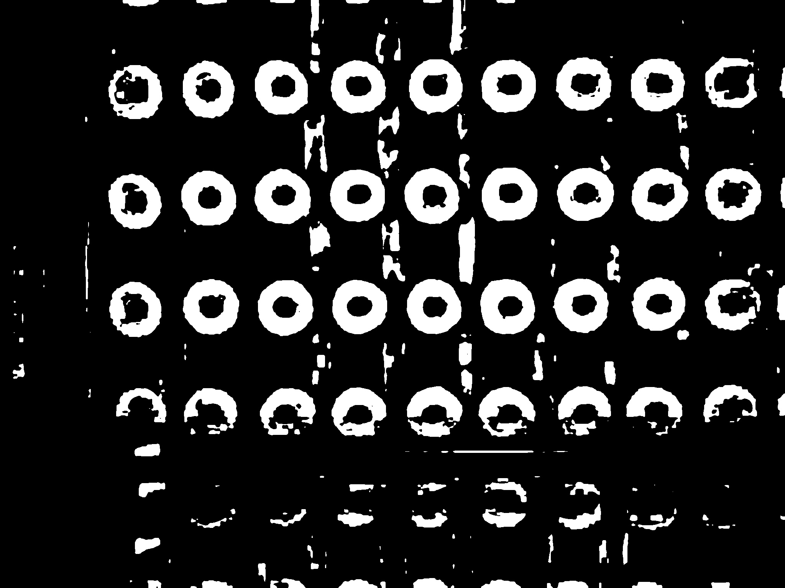
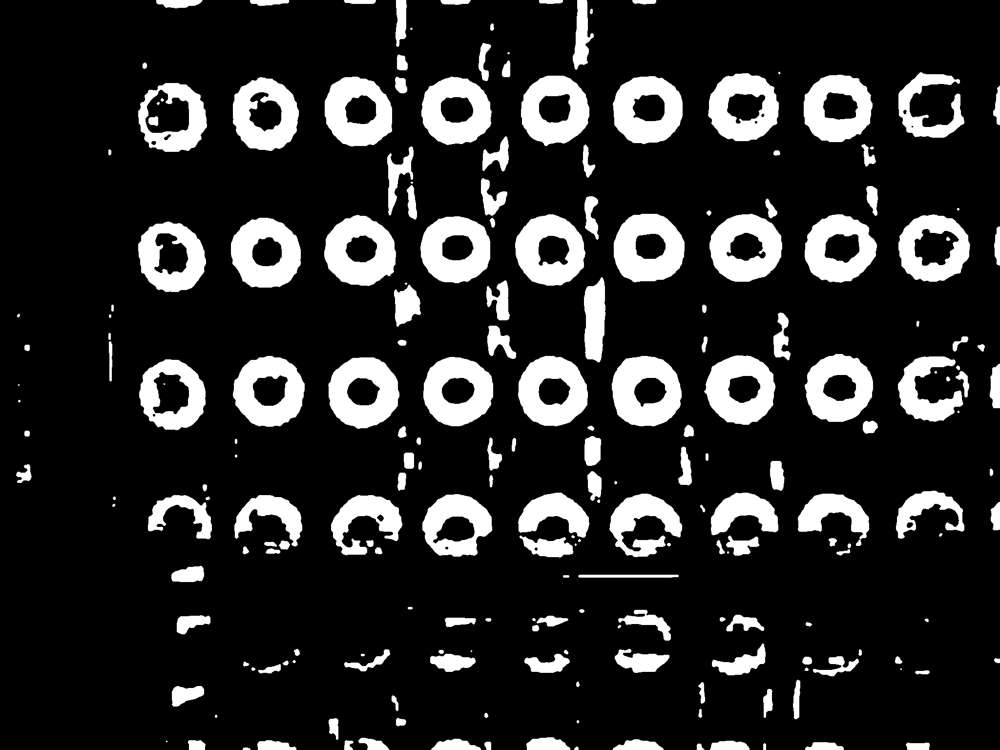
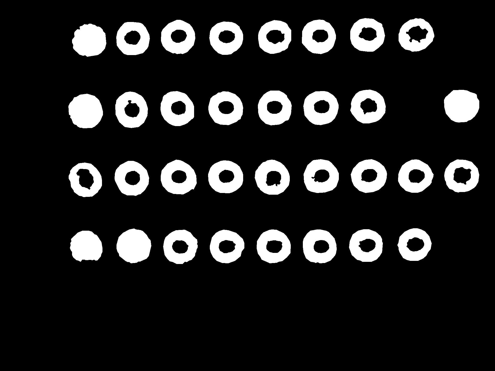
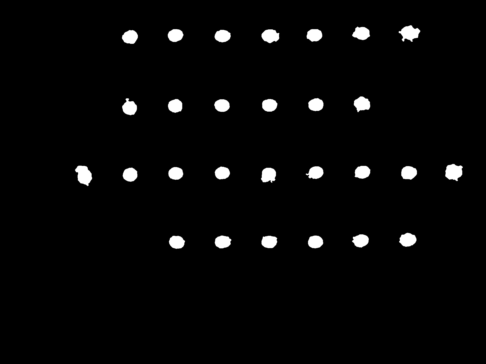
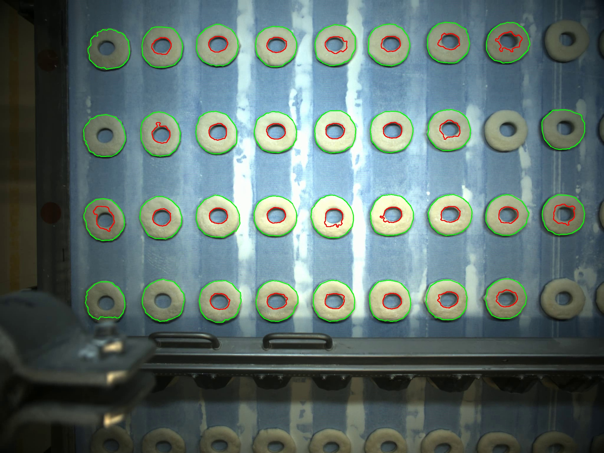

# Donut Mask Generation using Classical Computer Vision (C++17 & OpenCV)

An industrial image processing pipeline that automatically detects donuts and generates accurate donut and hole masks from conveyor belt images using **classical computer vision techniques** implemented in **C++17** with **OpenCV**.

This project was developed as part of the **XIS AI & Computer Vision Technical Assessment**. The implementation avoids deep learning entirely and instead relies on robust image processing, morphology, contour analysis, and geometric filtering.

---

## Features

- Classical Computer Vision (No Deep Learning)
- C++17 Implementation
- OpenCV 4.x
- Batch Processing of Multiple Images
- Automatic Donut Detection
- Accurate Hole Detection
- Binary Donut Mask Generation
- Boundary Refinement
- Overlay Visualization
- Modular Architecture
- CMake Build System

---

## Processing Pipeline

```
Input Image
      │
      ▼
Image Loading
      │
      ▼
Preprocessing
      │
      ▼
Adaptive Thresholding
      │
      ▼
Morphological Processing
      │
      ▼
Contour Detection
      │
      ▼
Geometric Filtering
      │
      ▼
Donut Mask Generation
      │
      ▼
Hole Extraction
      │
      ▼
Boundary Refinement
      │
      ▼
Overlay Generation
```

---

## Repository Structure

```
project-root/
│
├── src/                     # C++ source files
├── include/                 # Header files
├── docs/
│   ├── METHODOLOGY.md
│   ├── POSTPROCESSING.md
│   ├── RESULTS.md
│   └── SETUP.md
│
├── input_samples/           # Sample input images
├── output_samples/          # Sample outputs
│
├── CMakeLists.txt
├── README.md
├── LICENSE
└── .gitignore
```

---

## Technologies

- C++17
- OpenCV 4.x
- CMake
- Git

---

## Image Processing Methodology

The implementation follows a fully classical image processing pipeline.

### 1. Image Loading

- Load conveyor images
- Validate supported image formats

### 2. Preprocessing

- Convert to grayscale
- Illumination normalization
- Contrast enhancement
- Gaussian smoothing

### 3. Thresholding

- Otsu's Automatic Thresholding

### 4. Morphological Processing

- Opening
- Closing
- Median filtering

### 5. Contour Detection

- Connected contour extraction
- Geometric feature computation

### 6. Geometric Filtering

Contours are validated using:

- Area
- Circularity
- Solidity
- Extent
- Bounding box size

### 7. Donut Mask Generation

Accepted contours are rendered into binary donut masks.

### 8. Hole Detection

Hole candidates are extracted using contour-based geometric validation and subtracted from the donut mask.

### 9. Boundary Refinement

Refinement consists of:

- Morphological opening
- Morphological closing
- Median filtering
- Contour approximation

### 10. Overlay Generation

Final contours are drawn over the original image for visual verification.

- Green → Donut Boundary
- Red → Hole Boundary

---

# Sample Results

The pipeline was evaluated on a dataset of **10 industrial conveyor-belt images**.

To keep the repository lightweight, only one representative example is included below.

## Original Image



---

## Threshold



---

## Morphology



---

## Donut Mask



---

## Hole Mask



---

## Final Overlay



---

## Performance Summary

The proposed pipeline demonstrates robust performance across the evaluation dataset.

### Successfully Handles

- Uneven illumination
- Conveyor belt texture
- Multiple donuts
- Partial donuts
- Background noise
- Small reflections
- Corner vignetting

The same parameter configuration is applied to all images without manual tuning.

---

## Build Instructions

Clone the repository.

```bash
git clone https://github.com/Mohsan-R/donut-masker-cpp.git
cd donut-masker-cpp
```

Create a build directory.

```bash
mkdir build
cd build
```

Configure the project.

```bash
cmake ..
```

Build.

```bash
cmake --build .
```

---

## Usage

Run the executable:

```bash
donut_masker --input ../input_samples --output ../output_samples
```

Example:

```bash
donut_masker --input input_samples --output output_samples
```

---

## Documentation

Additional documentation is available in the `docs/` directory.

| File | Description |
|------|-------------|
| METHODOLOGY.md | Initial mask generation methodology and design rationale |
| POSTPROCESSING.md | Boundary refinement and post-processing techniques |
| RESULTS.md | Experimental results and performance evaluation |
| SETUP.md | Environment setup, dependencies, and build instructions |

---

## Full Dataset and Results

To keep the GitHub repository lightweight, only representative sample images are included.

The complete evaluation dataset (10 input images) and the corresponding generated outputs are available through the following links:
https://drive.google.com/drive/folders/1WIhZnx1vvgOXIsDGc1U9oezuqJVsEGA_?usp=sharing

---

## Future Improvements

Potential enhancements include:

- Adaptive illumination correction
- Ellipse-based contour fitting
- Touching object separation
- Performance optimization
- Cross-platform continuous integration

---

## License

This project is released under the MIT License.

---

## Author

**Mohsan Raza**

BS Computer Science (FAST-NUCES)

GitHub: https://github.com/Mohsan-R

